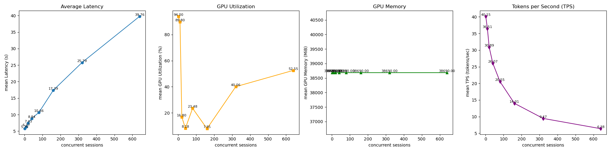
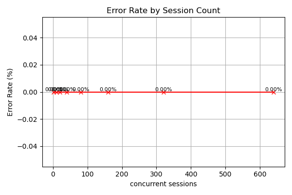

# vLLM-load-test

이 프로젝트는 [vLLM](https://github.com/vllm-project/vllm) 기반 LLM 서버의 **성능 한계**를 평가하기 위한 **부하 테스트 도구**입니다. 다양한 동시 세션 수 조건 하에서 Latency, GPU 자원 사용률, TPS 등을 측정하고, 실행 결과를 자동으로 시각화합니다.

## 📈 주요 지표

| 지표 | 설명 |
|------|------|
| **Latency** | 각 세션의 요청~응답 완료까지 소요 시간 (초) |
| **TPS** | 초당 생성된 토큰 수 (Streaming 기반) |
| **GPU Utilization** | nvidia-smi 기반 GPU 사용률 (%) |
| **GPU Memory** | vLLM이 점유한 메모리 (MiB) |
| **Error Rate** | 5xx, JSON decode 실패 등 예외 발생 비율 |

## ✅ 실행 방법

```bash
# vLLM 서버가 동작 중이어야 함
./run.sh
```

## 🖼️ 측정 결과

- A100 VRAM 40GB x 4






